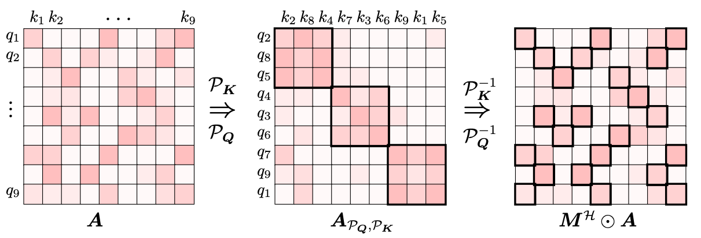
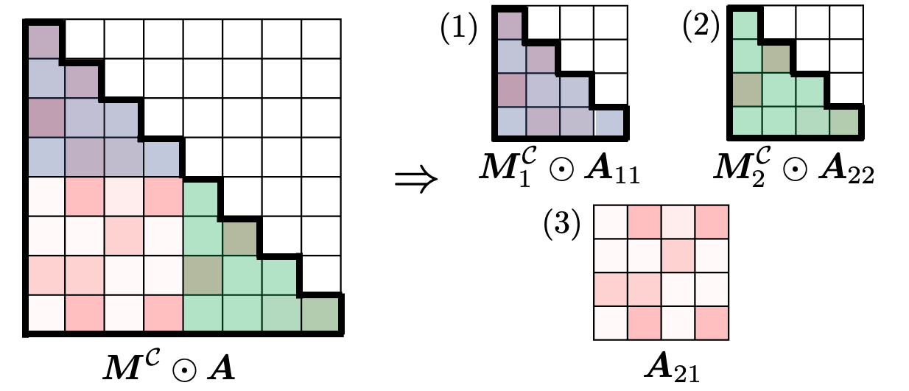

# HyperAttention: Long-context Attention in Near-Linear Time

The repository is the PyTorch implementation of HyperAttention paper:

HyperAttention: Long-context Attention in Near-Linear Time (https://arxiv.org/pdf/2310.05869.pdf)  
Insu Han, Rajesh Jayaram, Amin Karbasi, Vahab Mirrokni, David P. Woodruff, Amir Zandieh ($\alpha$~-~$\beta$)

# Requirements

The code requires ``pytorch`` and [``triton``](https://github.com/openai/triton).
We tested pytorch version 2.0.1, but any version >= 2.0.0 might work. 
We also make use of [FlashAttention](https://github.com/Dao-AILab/flash-attention/tree/main) in [triton](https://github.com/openai/triton) implementation. Please make sure to install triton version **2.0.0.dev20221202** as the triton version of FlashAttention works on this version. (We will update removing the dependency on specific triton version.)
```shell
pip install triton==2.0.0.dev20221202 --no-deps
```

# Benchmarks

The repository contains two benchmark experiments under the following files:

1. `benchmark_single_attention_layer.py`:  This code is for a benchmark estimating (GPU) runtimes of HyperAttention and FlashAttention exploring the sequence lengths from 1K to 131k. To run, 
    ```shell
    python benchmark_single_attention_layer.py --attn_method hyper 
    ```
    You can choose the computation mode among forward, backward or both. To specify the mode, please add ``--mode fwd`` for forward, ```--mode bwd``` for backward and ```--mode fwd+bwd``` for both. The default is ```fwd+bwd```. Additionally, to simulate attention without causal masking please add ```--no_causal```.


2. `benchmark_patch_llm.py`:  This code is for a benchmark of computing perplexity of pretrained language models where their self-attention is patched with HyperAttention. We choose [chatglm2-6b-32k](https://huggingface.co/THUDM/chatglm2-6b-32k) model and [LongBench](https://huggingface.co/datasets/THUDM/LongBench) datasets. To run with sequence length 32768

    ```shell
    python benchmark_patch_llm.py --attn_method hyper --seq_len 32768
    ```
    You can also override **FlashAttention** by specifying ``--attn_method flash`` and try other sequence lengths by specifying ```--seq_len 65536``` as long as the VRAM allows.

We ran all experiments on a single NVIDIA A100 with 40GB VRAM.

# How to use

The impelmentation of HyperAttention can be found in ``models/attention/hyper_attn.py``. An example of usage:

```python
from models.attention.hyper_attn import HyperAttention

attn = HyperAttention(
    input_dim=64 
    lsh_num_projs=7,
    block_size=256,
    sample_size=256
    min_seq_len=4096)

attn_output = attn(query, key, value, causal=True)
```

The module has the following parameters:
- ```input_dim```: the dimension of input query and key. (Required)
- ```lsh_num_projs```: the number of dimension in the hashing space. The default is 7.
- ```block_size```: the size of blocks for the block-diagonal approximation. The default is 256.
- ```sample_size```: the number of sampled columns in the attention matrix $A$. The default is 256.
- ```min_seq_len```: minimum sequence length that HyperAttention applies. When the sequence length is smaller than this value we compute exactly using the FlashAttention because additional operations of HyperAttention may not negligble. The default value is ```4096```.

# How it works
The algorithm consists of (1) finding heavy entries in attention matrix and (2) column subsampling. For (1), we use 
the **sorted locality sensitive hashing** (sortLSH) based on the Hamming distance. Applying sortLSH makes heavy entries in the  attention matrix (sorting rows/columns) located in near diagonal hence we do block-diagonal approximation which can be done fast.

<p align="center">
    
</p>

## Causal masking

To support the causal masking, we (implicitly) split the attention matrix into 3 parts: (1) upper-left, (2) lower-right and (3) lower-left. Both (1) and (2) still require the causal masking as they are near the diagonal and we recursively apply this process for them. The submatrix (3) is located entirely below the diagonal hence we run the HyperAttention without masking.


<p align="center">
    
</p>


# License
The code is licensed under the Apache 2.0 license.


# Citation

```bibtex
@article{hyperattention,
  title={Hyperattention: Long-context attention in near-linear time},
  author={Han, Insu and Jarayam, Rajesh and Karbasi, Amin and Mirrokni, Vahab and Woodruff, David and Zandieh, Amir},
  journal={arXiv preprint arXiv:2310.05869},
  year={2023}
}
```
